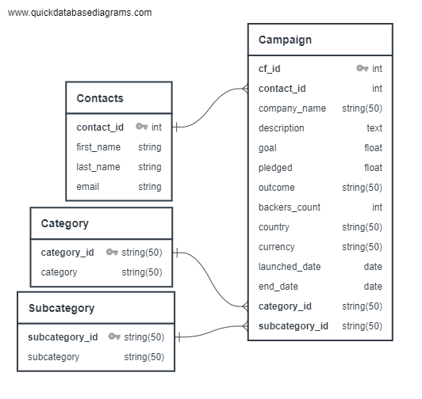

# Crowdfunding ETL (Extract, Transform & Load)

## Introduction

The ETL process is essential for dealing with data in the real world, where it often comes from various sources and can be messy. ETL, which stands for Extract, Transform, and Load, is a fundamental skill that allows you to work with data effectively. It involves extracting data from different sources, transforming it to make it clean and useful, and then loading it into a database for analysis. In this project, we'll apply ETL techniques to the following datasets.

## Data Sources

Inside the Resources Folder, you'll find two Excel files:

* `contacts.xlsx`
* `crowdfunding.xlsx`

## Database for Production

We plan to use a Relational Database (SQL) for the final production environment to store and manage our data. Here are the key details:

* **Database Type:** Relational (SQL)
* **Data Cleaning and Processing:** We'll use Jupyter Notebook
* **Packages Used:** pandas, numpy, datetime

We'll also create an Entity Relationship Diagram (ERD) to visualize the database structure using a tool like [Quick Database Diagrams](https://www.quickdatabasediagrams.com/).

**ERD**

# Project Outline

## Instructions

The project instructions are divided into the following sections:

### Create the Category and Subcategory DataFrames

1. Extract and transform data from `crowdfunding.xlsx` to create a category DataFrame with columns:
   - "category_id" (sequentially numbered from "cat1" to "catn")
   - "category" (containing category titles)
2. Export the category DataFrame as `category.csv` and save it to your GitHub repository.
3. Extract and transform data from `crowdfunding.xlsx` to create a subcategory DataFrame with columns:
   - "subcategory_id" (sequentially numbered from "subcat1" to "subcatn")
   - "subcategory" (containing subcategory titles)
4. Export the subcategory DataFrame as `subcategory.csv` and save it to your GitHub repository.

### Create the Campaign DataFrame

1. Extract and transform data from `crowdfunding.xlsx` to create a campaign DataFrame with columns:
   - "cf_id"
   - "contact_id"
   - "company_name"
   - "description" (formerly "blurb")
   - "goal" (converted to float)
   - "pledged" (converted to float)
   - "outcome"
   - "backers_count"
   - "country"
   - "currency"
   - "launch_date" (converted to datetime format)
   - "end_date" (converted to datetime format)
   - "category_id" (matching category IDs)
   - "subcategory_id" (matching subcategory IDs)
2. Export the campaign DataFrame as `campaign.csv` and save it to your GitHub repository.

### Create the Contacts DataFrame

1. Choose one of the following options to extract and transform data from `contacts.xlsx`:
   - Option 1: Use Python dictionary methods.
   - Option 2: Use regular expressions.
2. If you choose Option 1, import the `contacts.xlsx` file into a DataFrame, convert each row to a dictionary, and create a new DataFrame with extracted data. Split the "name" column into first and last names.
3. If you choose Option 2, extract "contact_id," "name," and "email" columns using regular expressions, create a new DataFrame with extracted data, and split the "name" column into first and last names.
4. Export the Contacts DataFrame as `contacts.csv` and save it to your GitHub repository.

### Create the Crowdfunding Database

1. Inspect the four CSV files and sketch an ERD of the tables using a tool like Quick Database Diagrams.
2. Use the ERD information to create table schemas for each CSV file.
3. Save the database schema as a Postgres file named `crowdfunding_db_schema.sql` and save it to your GitHub repository.
4. Create a new Postgres database named `crowdfunding_db`.
5. Use the database schema to create tables in the correct order, considering foreign keys.
6. Verify table creation by running SELECT statements for each table.
7. Import each CSV file into its corresponding SQL table.
8. Verify that each table contains the correct data by running SELECT statements for each table.